# Astronomer Cosmos Architecture

This document provides a comprehensive overview of the Astronomer Cosmos architecture, design principles, and key implementation concepts.

**Version:** 1.12.x | **Airflow Compatibility:** 2.4+ and 3.x

## Table of Contents

1. [Overview](#overview)
2. [High-Level Architecture](#high-level-architecture)
3. [Core Components](#core-components)
4. [Design Patterns](#design-patterns)
5. [Configuration System](#configuration-system)
6. [Operator Architecture](#operator-architecture)
7. [Execution Modes](#execution-modes)
8. [Watcher Mode (New)](#watcher-mode)
9. [Async Execution Mode (New)](#async-execution-mode)
10. [dbt Integration](#dbt-integration)
11. [Profile Mapping System](#profile-mapping-system)
12. [Airflow 2 vs 3 Compatibility](#airflow-2-vs-3-compatibility)
13. [Telemetry & Observability](#telemetry--observability)
14. [Data Flow](#data-flow)
15. [Extension Points](#extension-points)

---

## Overview

**Astronomer Cosmos** is an Apache Airflow provider package that orchestrates dbt (data build tool) projects within Airflow. It transforms dbt workflows into native Airflow DAGs and task groups, enabling seamless integration between the two ecosystems.

### Key Capabilities

- Convert dbt projects to Airflow DAGs automatically
- Support 10 execution modes (Local, Docker, Kubernetes, Watcher, Async, etc.)
- Map Airflow connections to dbt profiles automatically (18+ databases)
- Integrate with Airflow's scheduling, monitoring, and alerting
- Provide lineage tracking via OpenLineage and Airflow Datasets
- Full compatibility with both Airflow 2.x and 3.x

---

## High-Level Architecture

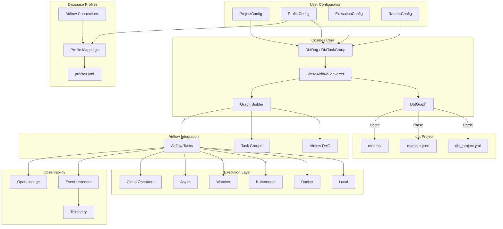

---

## Core Components

### Component Overview

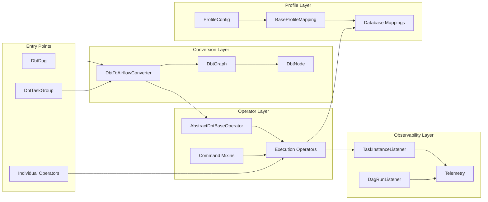

### Directory Structure

```
cosmos/
├── __init__.py                    # Public API exports
├── config.py                      # Configuration classes
├── constants.py                   # ExecutionMode, LoadMode, TestBehavior enums
├── converter.py                   # DbtToAirflowConverter
├── versioning.py                  # Content-based hashing for caching (NEW)
│
├── airflow/                       # High-level DAG/TaskGroup APIs
│   ├── dag.py                    # DbtDag class
│   ├── task_group.py             # DbtTaskGroup class
│   └── graph.py                  # Graph building logic
│
├── core/                          # Core abstractions
│   ├── airflow.py                # get_airflow_task() function
│   └── graph/
│       └── entities.py           # Task, Group, CosmosEntity models
│
├── dbt/                           # dbt integration
│   ├── graph.py                  # DbtNode, DbtGraph
│   ├── runner.py                 # dbtRunner wrapper (NEW)
│   ├── selector.py               # Node selection logic
│   ├── executable.py             # dbt executable detection
│   ├── project.py                # Project utilities
│   └── parser/                   # Manifest/output parsing
│
├── operators/                     # Execution operators (60+)
│   ├── base.py                   # AbstractDbtBaseOperator + Mixins
│   ├── local.py                  # Local execution (17 operators)
│   ├── docker.py                 # Docker execution
│   ├── kubernetes.py             # Kubernetes execution
│   ├── virtualenv.py             # Virtualenv execution
│   ├── watcher.py                # Watcher mode operators (NEW)
│   ├── airflow_async.py          # Async execution operators (NEW)
│   ├── aws_ecs.py                # AWS ECS operators (NEW)
│   ├── aws_eks.py                # AWS EKS operators
│   ├── azure_container_instance.py
│   ├── gcp_cloud_run_job.py
│   │
│   ├── _watcher/                 # Watcher internals (NEW)
│   │   ├── state.py              # AF2/AF3 state management
│   │   └── triggerer.py          # WatcherTrigger for deferrable sensors
│   │
│   └── _asynchronous/            # Async internals (NEW)
│       ├── base.py               # Factory operator
│       ├── bigquery.py           # BigQuery async operator
│       └── databricks.py         # Databricks async (stub)
│
├── profiles/                      # Database profile mappings (18+)
│   ├── base.py                   # BaseProfileMapping
│   ├── postgres/
│   ├── snowflake/
│   ├── bigquery/
│   ├── redshift/
│   ├── databricks/
│   ├── duckdb/                   # NEW
│   ├── mysql/                    # NEW
│   ├── sqlserver/                # NEW
│   ├── trino/
│   ├── spark/
│   ├── athena/
│   ├── oracle/
│   ├── teradata/
│   ├── vertica/
│   ├── clickhouse/
│   └── exasol/
│
├── plugin/                        # Airflow plugin
│   ├── __init__.py               # Plugin registration
│   ├── airflow2.py               # Flask-based UI (AF2)
│   ├── airflow3.py               # FastAPI-based UI (AF3) (NEW)
│   ├── storage.py                # Storage type detection
│   ├── snippets.py               # UI snippets
│   └── templates/
│
├── listeners/                     # Event listeners (NEW)
│   ├── dag_run_listener.py       # DAG run telemetry
│   └── task_instance_listener.py # Task instance telemetry (NEW)
│
├── hooks/                         # Airflow hooks
│   └── subprocess.py             # Subprocess execution hook
│
├── cache.py                       # Caching mechanisms
├── dataset.py                     # Airflow Dataset/Asset support
├── io.py                          # File I/O utilities
├── settings.py                    # Application settings
└── telemetry.py                   # Telemetry emission
```

---

## Design Patterns

### 1. Mixin Composition Pattern

The operator system uses mixin classes to compose command functionality with execution modes.

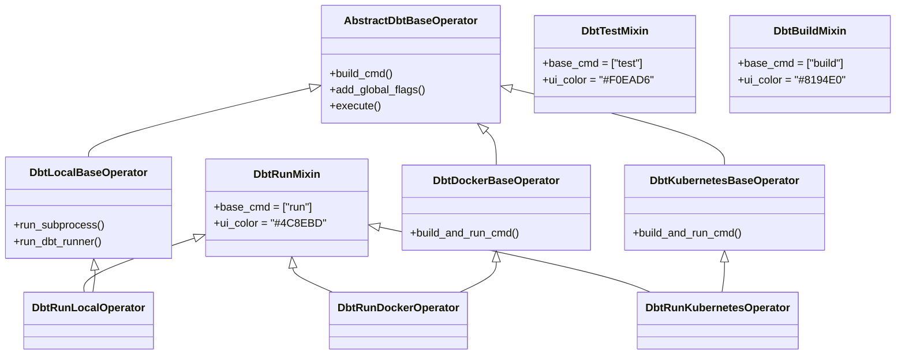

### 2. Producer-Consumer Pattern (Watcher Mode)

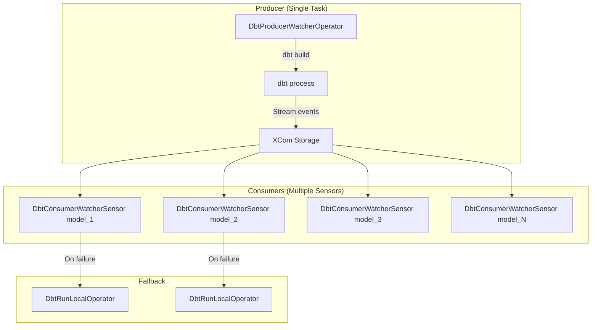

### 3. Factory Pattern (Dynamic Operator Creation)

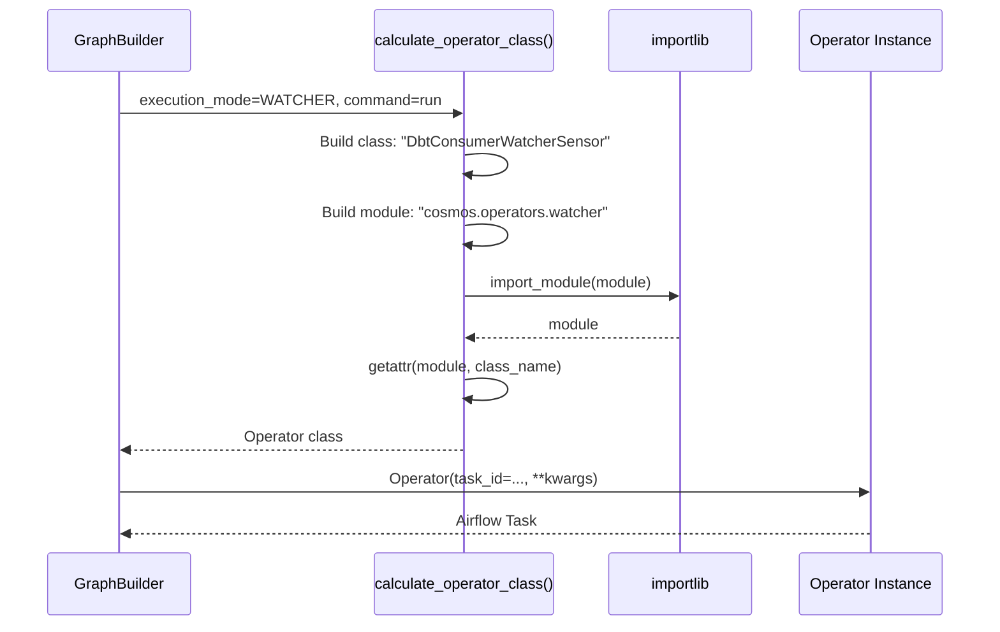

### 4. Registry Pattern (Profile Mappings)

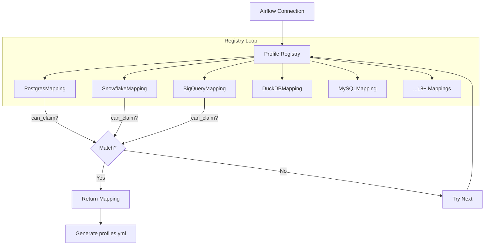

### 5. Strategy Pattern (Invocation Modes)

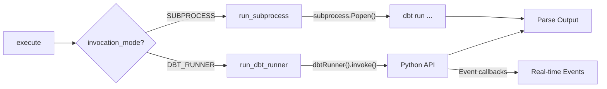

---

## Configuration System

### Configuration Classes

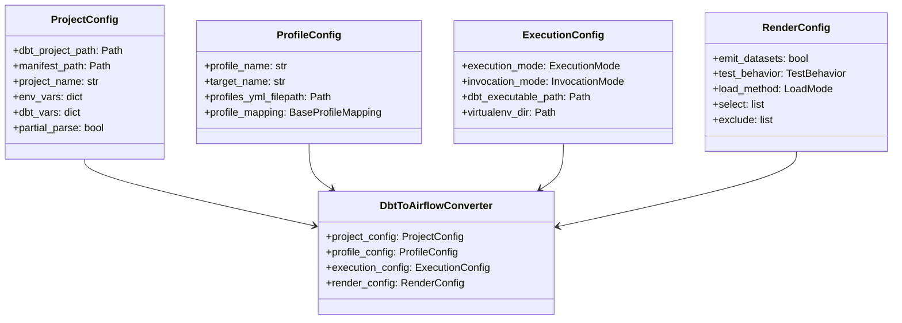

### Invocation Modes

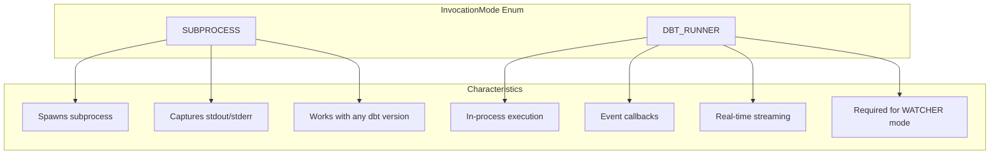

---

## Execution Modes

### Complete Execution Mode Matrix

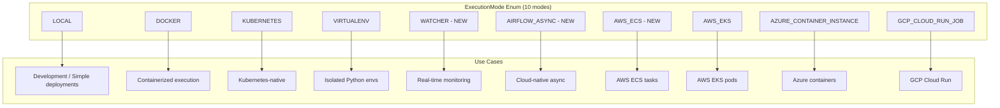

### Valid Mode Combinations

| ExecutionMode | InvocationMode.SUBPROCESS | InvocationMode.DBT_RUNNER |
|---------------|---------------------------|---------------------------|
| LOCAL | ✅ Default | ✅ Supported |
| VIRTUALENV | ✅ Only option | ❌ Not implemented |
| WATCHER | ✅ Fallback | ✅ Preferred (events) |
| DOCKER | N/A | N/A |
| KUBERNETES | N/A | N/A |
| AWS_ECS | N/A | N/A |
| AIRFLOW_ASYNC | N/A (profile-specific) | N/A |

---

## Watcher Mode

### Overview

The WATCHER execution mode implements a **producer-consumer pattern** for efficient, near real-time dbt execution monitoring.

### Architecture

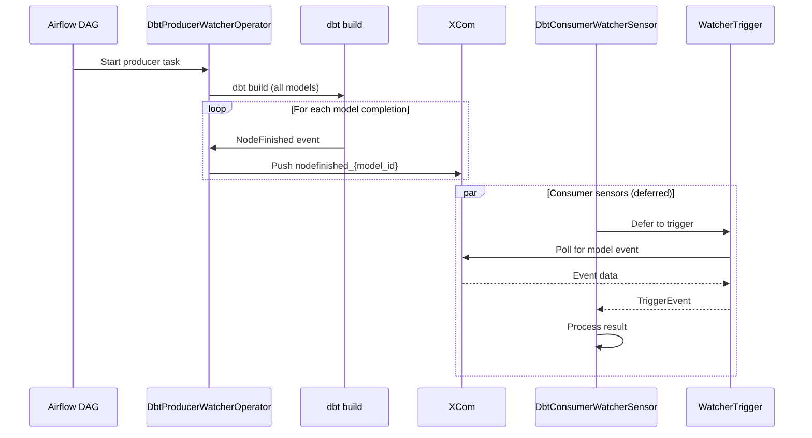

### Key Classes

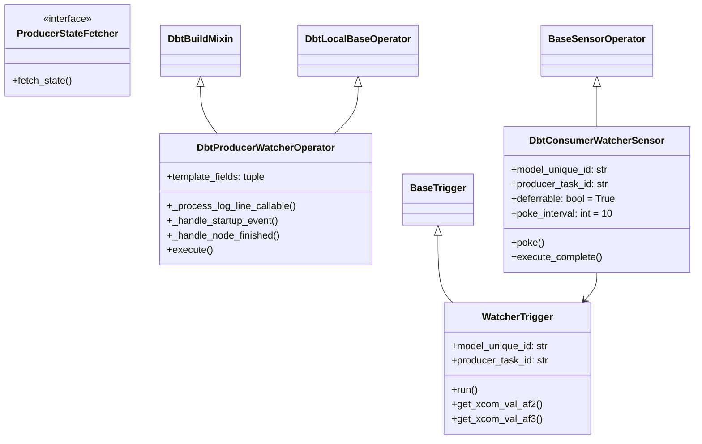

### XCom Data Flow

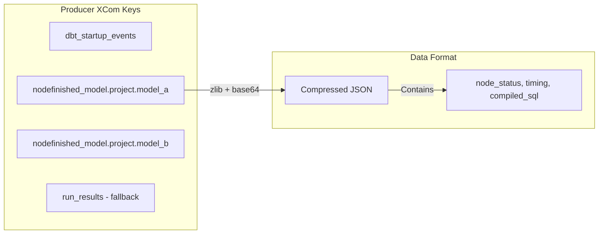

---

## Async Execution Mode

### Overview

The AIRFLOW_ASYNC execution mode enables **deferrable, cloud-native execution** using database-specific async operators.

### Architecture

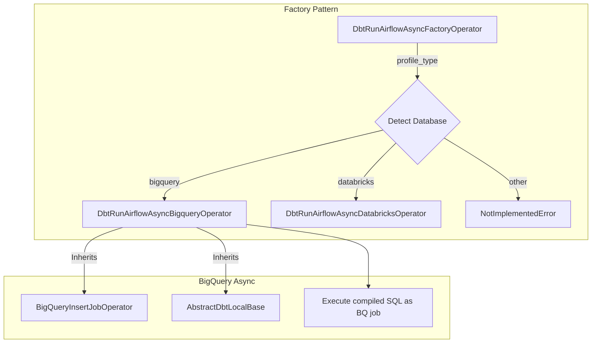

### Supported Databases

| Database | Status | Operator Class |
|----------|--------|----------------|
| BigQuery | ✅ Implemented | `DbtRunAirflowAsyncBigqueryOperator` |
| Databricks | 🚧 Stub | `DbtRunAirflowAsyncDatabricksOperator` |
| Others | ❌ Not supported | N/A |

### Class Hierarchy

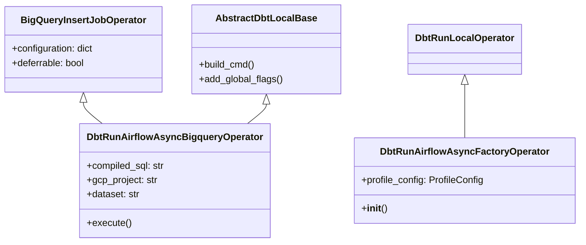

---

## dbt Integration

### dbt Runner Module

The `cosmos/dbt/runner.py` module provides a wrapper around `dbt.cli.main.dbtRunner` for in-process execution.

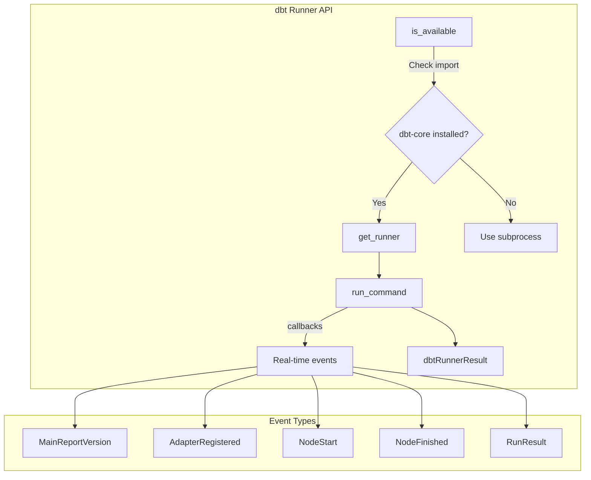

### Project Parsing Flow

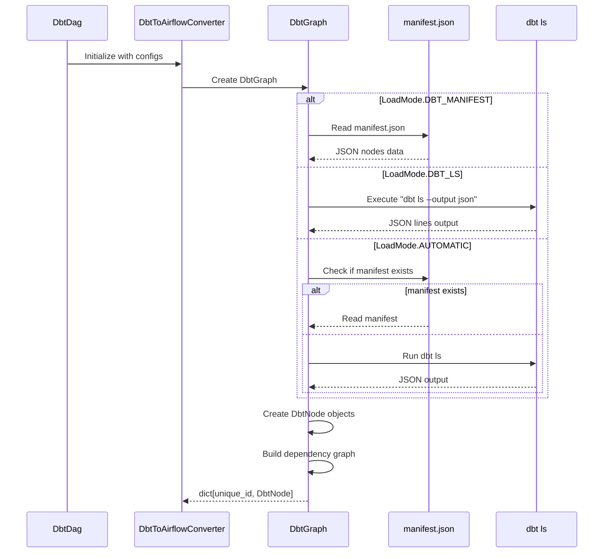

### Node Selection (Graph Operators)

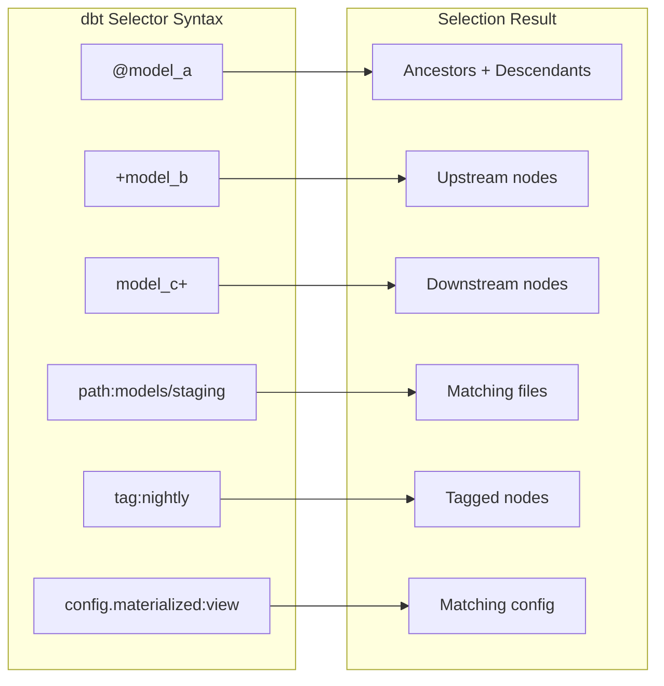

---

## Profile Mapping System

### Supported Databases (18+)

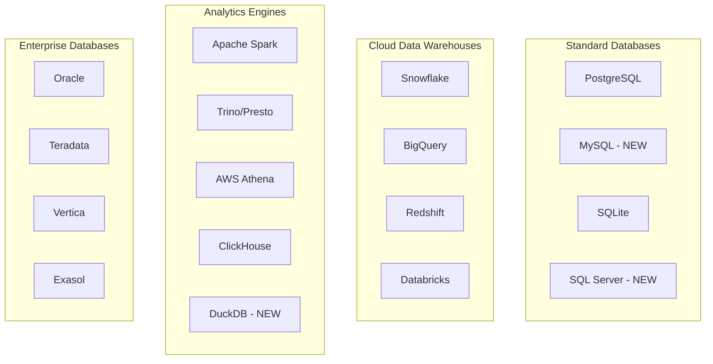

### Profile Mapping Architecture

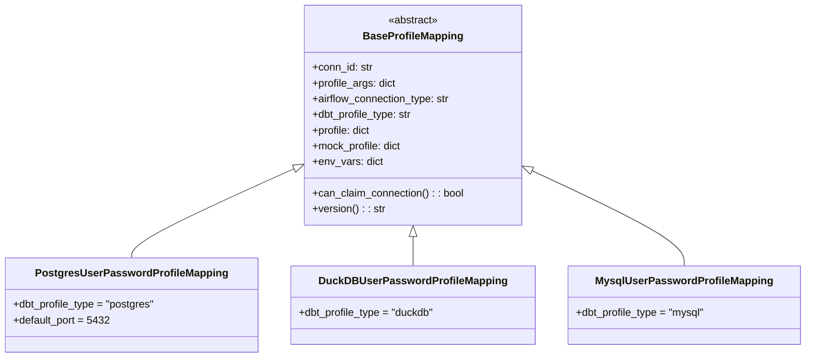

---

## Airflow 2 vs 3 Compatibility

### Version Abstraction Layer

```mermaid
flowchart TD
    subgraph "Import Abstraction"
        CHECK{Airflow Version?}
        CHECK --> |"< 3.0"| AF2[Airflow 2 imports]
        CHECK --> |">= 3.0"| AF3[Airflow 3 imports]
    end

    subgraph "Airflow 2"
        AF2 --> BO2[airflow.models.BaseOperator]
        AF2 --> DS2[airflow.datasets.Dataset]
        AF2 --> TG2[airflow.utils.task_group.TaskGroup]
        AF2 --> CTX2[airflow.utils.context.Context]
    end

    subgraph "Airflow 3"
        AF3 --> BO3[airflow.sdk.bases.operator.BaseOperator]
        AF3 --> DS3[airflow.sdk.definitions.asset.Asset]
        AF3 --> TG3[airflow.sdk.TaskGroup]
        AF3 --> CTX3[airflow.sdk.definitions.context.Context]
    end
```

### Plugin Architecture

```mermaid
flowchart LR
    subgraph "Airflow 2 Plugin"
        AF2_PLUGIN[CosmosPlugin]
        AF2_PLUGIN --> FLASK[Flask-based UI]
        AF2_PLUGIN --> ABV[AirflowBaseView]
        FLASK --> DOCS2[/cosmos/dbt_docs]
    end

    subgraph "Airflow 3 Plugin"
        AF3_PLUGIN[CosmosAF3Plugin]
        AF3_PLUGIN --> FASTAPI[FastAPI-based UI]
        AF3_PLUGIN --> EXT[External Views]
        FASTAPI --> DOCS3[/cosmos/dbt_docs]
    end
```

### State Management (Watcher Mode)

```mermaid
flowchart TD
    BUILD[build_producer_state_fetcher]
    BUILD --> VER{airflow_version}

    VER --> |"< 3.0"| AF2_STATE[Airflow 2 State Fetcher]
    VER --> |">= 3.0"| AF3_STATE[Airflow 3 State Fetcher]

    AF2_STATE --> SQL[TaskInstance.query with SQL session]
    AF3_STATE --> SDK[RuntimeTaskInstance.get_task_states]
```

---

## Telemetry & Observability

### Listener Architecture

```mermaid
flowchart TD
    subgraph "Event Listeners"
        TIL[task_instance_listener]
        DRL[dag_run_listener]
    end

    subgraph "Hooks"
        TIL --> ON_RUN[@on_task_instance_running]
        TIL --> ON_SUCCESS[@on_task_instance_success]
        TIL --> ON_FAIL[@on_task_instance_failed]

        DRL --> DAG_SUCCESS[@on_dag_run_success]
        DRL --> DAG_FAIL[@on_dag_run_failed]
    end

    subgraph "Metrics Collected"
        ON_RUN --> M1[execution_mode]
        ON_RUN --> M2[invocation_mode]
        ON_RUN --> M3[dbt_command]
        ON_SUCCESS --> M4[duration]
        ON_FAIL --> M5[error_type]
    end

    M1 --> EMIT[emit_usage_metrics]
    M2 --> EMIT
    M3 --> EMIT
    M4 --> EMIT
    M5 --> EMIT
```

### Task Detection

```python
# Detection functions in task_instance_listener.py
_is_cosmos_task()      # Check if task uses Cosmos operators
_execution_mode()      # Extract execution mode from module path
_invocation_mode()     # Extract DBT_RUNNER or SUBPROCESS
_dbt_command()         # Extract run, build, test, seed, etc.
```

---

## Data Flow

### Complete Request Flow

```mermaid
sequenceDiagram
    participant USER as User
    participant DD as DbtDag
    participant CONV as Converter
    participant DG as DbtGraph
    participant GB as GraphBuilder
    participant AF as Airflow
    participant OP as Operator
    participant DBT as dbt
    participant TEL as Telemetry

    USER->>DD: Define DbtDag(configs)
    DD->>CONV: Initialize converter
    CONV->>DG: Parse dbt project
    DG-->>CONV: DbtNode dictionary

    CONV->>GB: build_airflow_graph()
    GB->>GB: Create tasks for each node
    GB-->>CONV: Airflow DAG with tasks

    CONV-->>DD: Complete DAG
    DD-->>AF: Register DAG

    Note over AF: DAG execution triggered

    AF->>OP: Execute task
    OP->>TEL: on_task_instance_running
    OP->>DBT: dbt command
    DBT-->>OP: Execution result
    OP->>TEL: on_task_instance_success/failed
    OP-->>AF: Task complete
```

### Caching Architecture

```mermaid
flowchart TD
    subgraph "Cache Layers"
        L1[Profile Cache - SHA256 versioned]
        L2[dbt ls Cache]
        L3[Manifest Cache]
        L4[Package Lock Cache]
        L5[Remote Cache - S3/GCS/Azure]
    end

    subgraph "Versioning"
        VER[versioning.py]
        VER --> |"MD5 hash"| L1
        VER --> |"Content-based"| L3
    end
```

---

## Extension Points

### Adding New Execution Mode

```mermaid
flowchart TD
    NEW[New Execution Mode] --> CONST[Add to ExecutionMode enum]
    CONST --> BASE[Create base operator class]
    BASE --> |"Extend AbstractDbtBaseOperator"| IMPL[Implement build_and_run_cmd]

    IMPL --> MIX1[DbtRunNewModeOperator]
    IMPL --> MIX2[DbtTestNewModeOperator]
    IMPL --> MIXN[...]

    MIX1 --> REG[Register in operators/__init__.py]
    REG --> GRAPH[Update graph.py calculate_operator_class]
    GRAPH --> EXPORT[Export in cosmos/__init__.py]
```

### Adding New Database Profile

```mermaid
flowchart TD
    NEW[New Database] --> CREATE[Create profiles/newdb/]
    CREATE --> IMPL[Implement BaseProfileMapping subclass]

    IMPL --> CAN[can_claim_connection]
    IMPL --> PROFILE[profile property]
    IMPL --> MOCK[mock_profile property]
    IMPL --> ENV[env_vars property]

    PROFILE --> REG[Add to profile_mappings list]
    REG --> EXPORT[Export in profiles/__init__.py]
```

---

## Operator Hierarchy

### Complete Operator Matrix

| Command | Local | Docker | K8s | Virtualenv | Watcher | Async | AWS ECS | AWS EKS | Azure ACI | GCP CR |
|---------|-------|--------|-----|------------|---------|-------|---------|---------|-----------|--------|
| run | ✅ | ✅ | ✅ | ✅ | Consumer | ✅ | ✅ | ✅ | ✅ | ✅ |
| test | ✅ | ✅ | ✅ | ✅ | Consumer | - | ✅ | ✅ | ✅ | ✅ |
| build | ✅ | ✅ | ✅ | ✅ | Producer | - | ✅ | ✅ | ✅ | ✅ |
| seed | ✅ | ✅ | ✅ | ✅ | - | - | ✅ | ✅ | ✅ | ✅ |
| snapshot | ✅ | ✅ | ✅ | ✅ | - | - | ✅ | ✅ | ✅ | ✅ |
| source | ✅ | ✅ | ✅ | - | Consumer | - | ✅ | ✅ | ✅ | ✅ |
| compile | ✅ | - | - | - | - | - | ✅ | - | - | - |
| docs | ✅ | - | - | - | - | - | - | - | - | - |
| clone | ✅ | - | - | - | - | - | ✅ | - | - | - |

---

## Key Design Principles

### 1. Airflow-First Design
- Uses native Airflow patterns (DAGs, Operators, Hooks, Plugins, Listeners)
- Leverages Airflow's scheduling, monitoring, and alerting
- Integrates with Airflow Datasets/Assets for lineage
- Full compatibility with Airflow 2.x and 3.x

### 2. Configuration Over Code
- Four configuration classes cover all use cases
- Sensible defaults with full customization
- Automatic profile mapping reduces boilerplate

### 3. Composition Over Inheritance
- Mixin-based operator design
- Easy to add new commands or execution modes
- Clear separation of concerns

### 4. Performance Optimization
- Multi-level caching (profiles, manifests, dbt ls output)
- Lazy loading of optional dependencies
- dbt-runner mode for faster in-process execution
- Watcher mode for efficient multi-model execution

### 5. Extensibility
- Registry pattern for profile mappings
- Factory pattern for operator instantiation
- Clear extension points for new databases and execution modes

### 6. Observability
- Built-in telemetry via listeners
- OpenLineage integration
- Comprehensive logging

---

## Summary

| Aspect | Details |
|--------|---------|
| **Entry Points** | DbtDag, DbtTaskGroup, Individual Operators |
| **Execution Modes** | 10 (Local, Docker, K8s, Virtualenv, Watcher, Async, AWS ECS/EKS, Azure ACI, GCP CR) |
| **Operators** | 60+ (8 commands × multiple execution modes) |
| **Databases** | 18+ with 20+ profile mapping classes |
| **Design Patterns** | Mixin, Factory, Registry, Producer-Consumer, Template Method, Strategy |
| **Caching** | Profile (versioned), Manifest, dbt ls, Package lock, Remote |
| **Airflow Compat** | Full support for Airflow 2.4+ and 3.x |
| **Observability** | Task/DAG listeners, Telemetry, OpenLineage |

The architecture enables flexible dbt orchestration while maintaining Airflow-native patterns, supporting diverse execution environments, and providing comprehensive observability.
