# Astronomer Cosmos Architecture

This document provides a comprehensive overview of the Astronomer Cosmos architecture, design principles, and key implementation concepts.

## Table of Contents

1. [Overview](#overview)
2. [High-Level Architecture](#high-level-architecture)
3. [Core Components](#core-components)
4. [Design Patterns](#design-patterns)
5. [Configuration System](#configuration-system)
6. [Operator Architecture](#operator-architecture)
7. [dbt Integration](#dbt-integration)
8. [Profile Mapping System](#profile-mapping-system)
9. [Data Flow](#data-flow)
10. [Extension Points](#extension-points)

---

## Overview

**Astronomer Cosmos** is an Apache Airflow provider package that orchestrates dbt (data build tool) projects within Airflow. It transforms dbt workflows into native Airflow DAGs and task groups, enabling seamless integration between the two ecosystems.

### Key Capabilities

- Convert dbt projects to Airflow DAGs automatically
- Support multiple execution modes (Local, Docker, Kubernetes, etc.)
- Map Airflow connections to dbt profiles automatically
- Integrate with Airflow's scheduling, monitoring, and alerting
- Provide lineage tracking via OpenLineage and Airflow Datasets

---

## High-Level Architecture

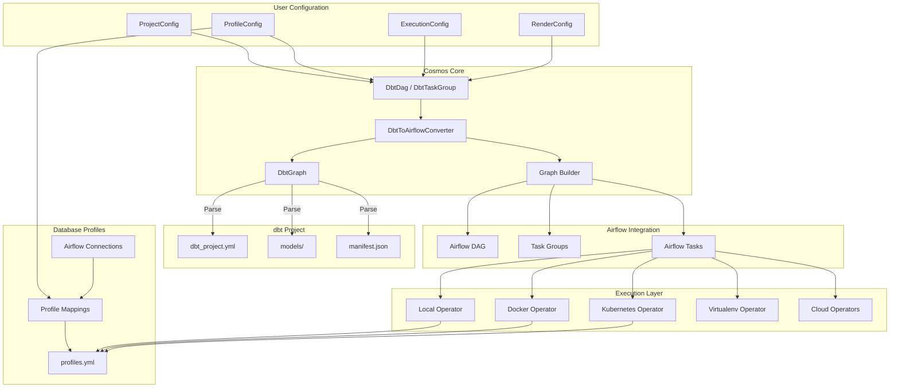

---

## Core Components

### Component Overview

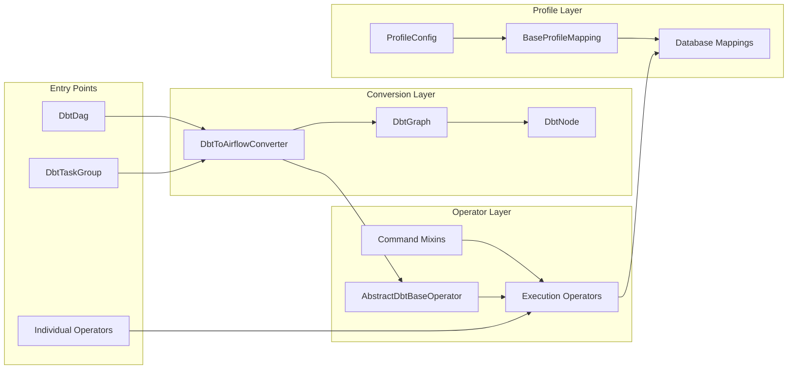

### Directory Structure

```
cosmos/
├── __init__.py              # Public API exports
├── airflow/                 # High-level DAG/TaskGroup APIs
│   ├── dag.py              # DbtDag class
│   ├── task_group.py       # DbtTaskGroup class
│   └── graph.py            # Graph building logic
├── core/                    # Core abstractions
│   └── graph/
│       └── entities.py     # Task, Group, CosmosEntity models
├── dbt/                     # dbt integration
│   ├── graph.py            # DbtNode, DbtGraph
│   ├── selector.py         # Node selection logic
│   └── parser/             # Manifest/output parsing
├── operators/              # Execution operators (50+)
│   ├── base.py             # AbstractDbtBaseOperator
│   ├── local.py            # Local execution
│   ├── docker.py           # Docker execution
│   ├── kubernetes.py       # Kubernetes execution
│   └── virtualenv.py       # Virtualenv execution
├── profiles/               # Database profile mappings (15+)
│   ├── base.py             # BaseProfileMapping
│   ├── postgres/
│   ├── snowflake/
│   └── bigquery/
├── plugin/                 # Airflow plugin
├── config.py               # Configuration classes
├── converter.py            # Core conversion logic
├── cache.py                # Caching mechanisms
└── constants.py            # Enums and constants
```

---

## Design Patterns

### 1. Mixin Composition Pattern

The operator system uses mixin classes to compose command functionality with execution modes.

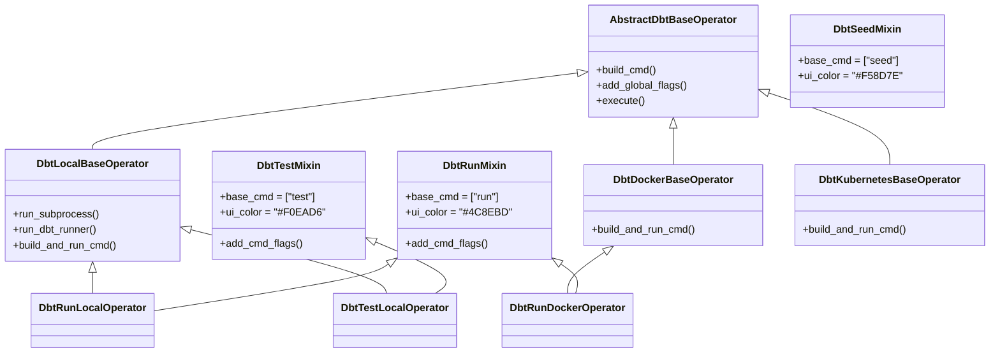

**Benefits:**
- Reusable command logic across 7+ execution modes
- Clean separation of concerns
- Easy to add new commands or execution modes

### 2. Registry Pattern

Profile mappings are registered in a central registry for automatic detection.

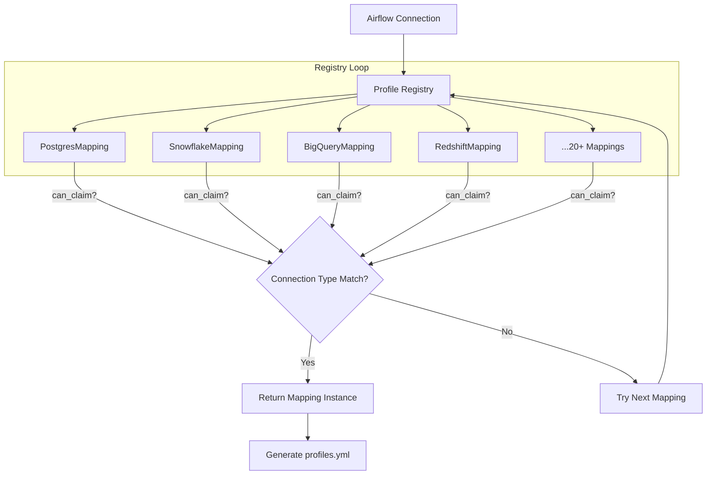

### 3. Factory Pattern

Operators are dynamically instantiated based on configuration.

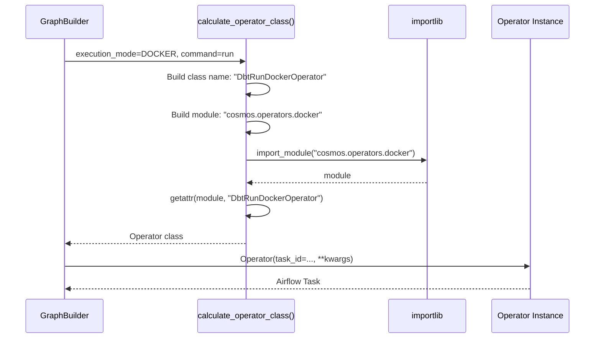

### 4. Template Method Pattern

Base operator defines the command building process; subclasses implement specific steps.

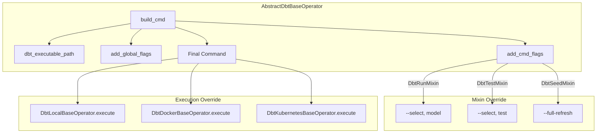

### 5. Strategy Pattern

Different invocation strategies for dbt execution.

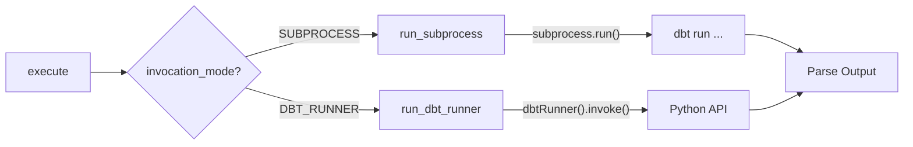

---

## Configuration System

### Configuration Classes Hierarchy

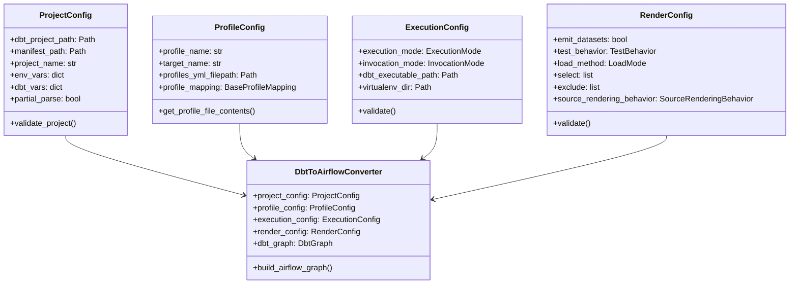

### Execution Modes

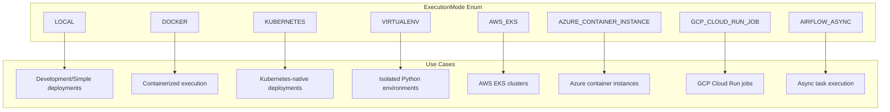

### Load Methods

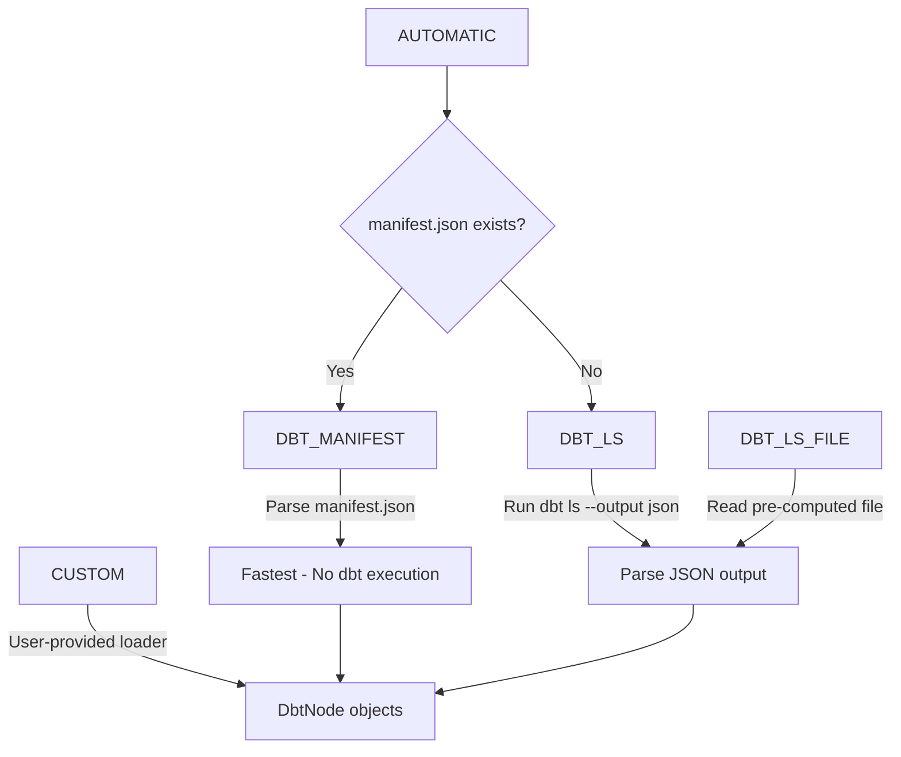

---

## Operator Architecture

### Complete Operator Hierarchy

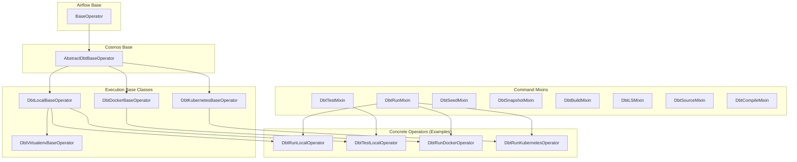

### Operator Composition Matrix

| Command | Local | Docker | Kubernetes | Virtualenv | AWS EKS | Azure ACI | GCP Cloud Run |
|---------|-------|--------|------------|------------|---------|-----------|---------------|
| run | DbtRunLocalOperator | DbtRunDockerOperator | DbtRunKubernetesOperator | DbtRunVirtualenvOperator | DbtRunAwsEksOperator | DbtRunAzureContainerInstanceOperator | DbtRunGcpCloudRunJobOperator |
| test | DbtTestLocalOperator | DbtTestDockerOperator | DbtTestKubernetesOperator | DbtTestVirtualenvOperator | ... | ... | ... |
| seed | DbtSeedLocalOperator | DbtSeedDockerOperator | DbtSeedKubernetesOperator | ... | ... | ... | ... |
| snapshot | DbtSnapshotLocalOperator | ... | ... | ... | ... | ... | ... |
| build | DbtBuildLocalOperator | ... | ... | ... | ... | ... | ... |
| compile | DbtCompileLocalOperator | ... | ... | ... | ... | ... | ... |
| source | DbtSourceLocalOperator | ... | ... | ... | ... | ... | ... |
| docs | DbtDocsLocalOperator | ... | ... | ... | ... | ... | ... |

---

## dbt Integration

### dbt Project Parsing Flow

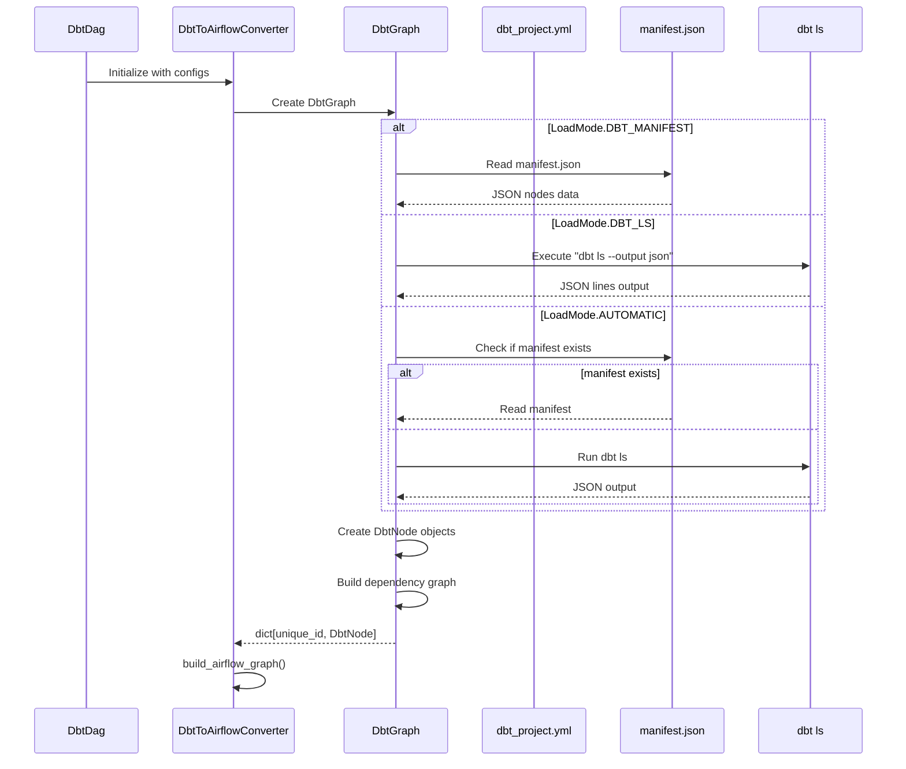

### DbtNode Structure

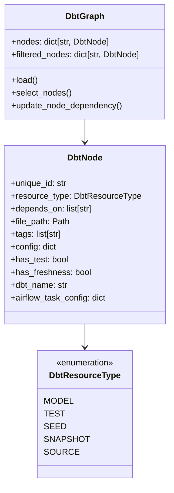

### Node Selection (Graph Operators)

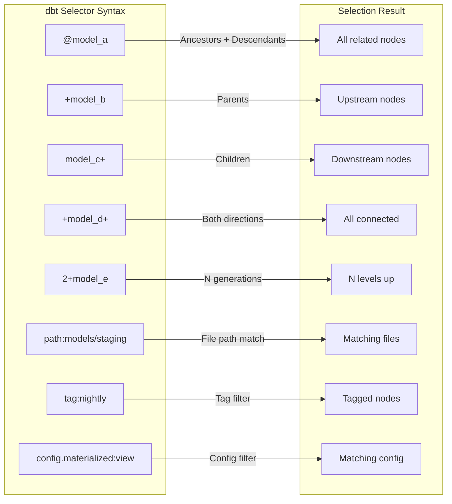

### Test Behavior Modes

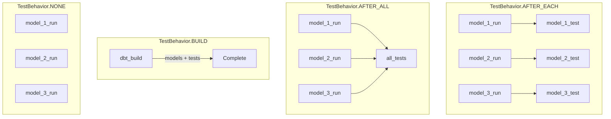

---

## Profile Mapping System

### Profile Mapping Architecture

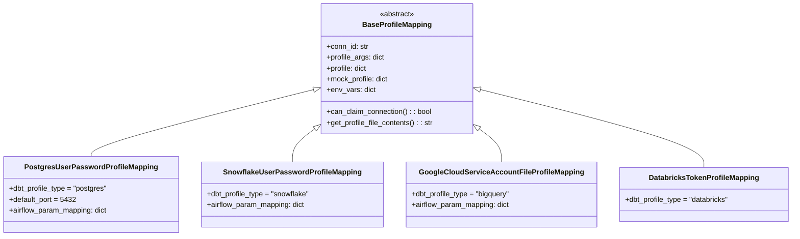

### Connection to Profile Transformation

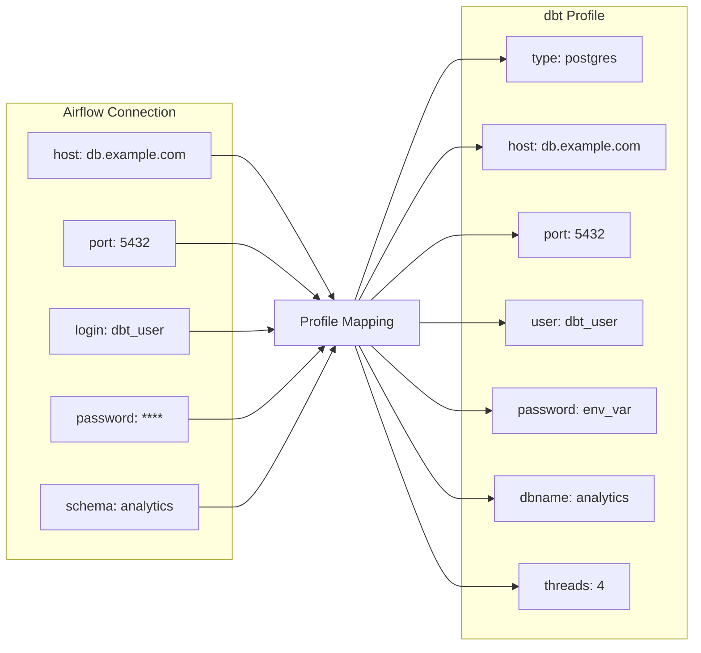

### Supported Database Profiles

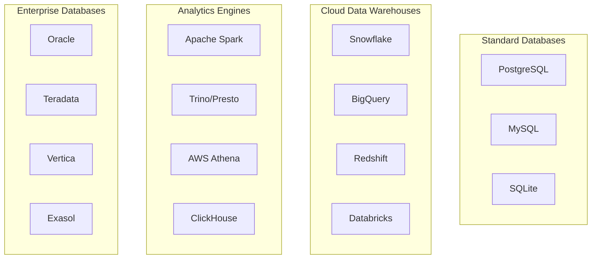

---

## Data Flow

### Complete Request Flow

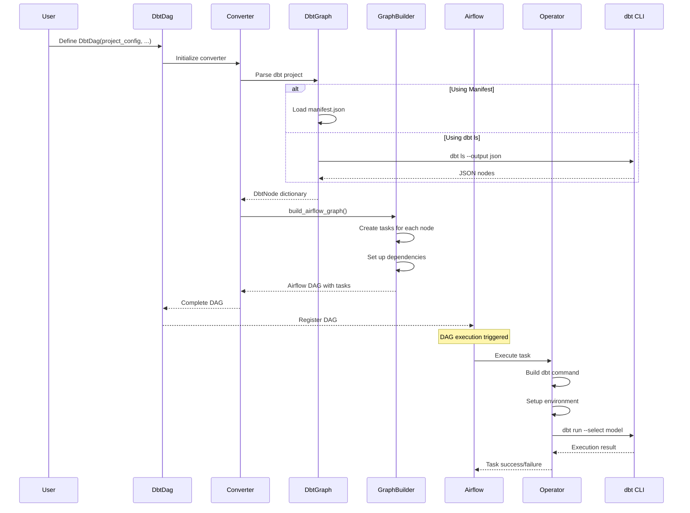

### Caching Architecture

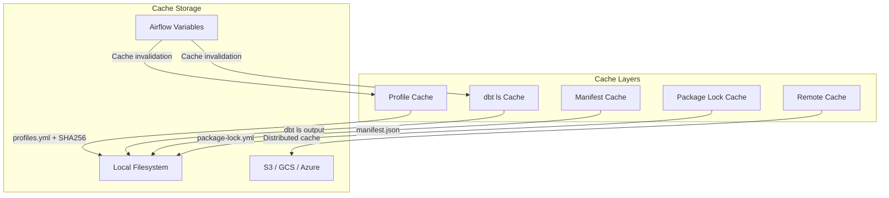

---

## Extension Points

### Adding New Execution Mode

```mermaid
flowchart TD
    NEW[New Execution Mode] --> BASE[Create Base Operator]
    BASE --> |"Extend AbstractDbtBaseOperator"| IMPL[Implement build_and_run_cmd]

    IMPL --> MIX1[Create DbtRunNewModeOperator]
    IMPL --> MIX2[Create DbtTestNewModeOperator]
    IMPL --> MIX3[Create DbtSeedNewModeOperator]

    MIX1 --> |"DbtRunMixin + NewModeBaseOperator"| REG[Register in operators/__init__.py]
    MIX2 --> REG
    MIX3 --> REG

    REG --> CONST[Add to ExecutionMode enum]
    CONST --> EXPORT[Export in cosmos/__init__.py]
```

### Adding New Database Profile

```mermaid
flowchart TD
    NEW[New Database] --> CREATE[Create profiles/newdb/]
    CREATE --> IMPL[Implement BaseProfileMapping]

    IMPL --> METHODS[Define Methods]
    METHODS --> CAN[can_claim_connection]
    METHODS --> PROFILE[profile property]
    METHODS --> MOCK[mock_profile property]
    METHODS --> ENV[env_vars property]

    CAN --> REG[Add to profile_mappings list]
    PROFILE --> REG
    MOCK --> REG
    ENV --> REG

    REG --> EXPORT[Export in profiles/__init__.py]
```

---

## Plugin Architecture

### Airflow Plugin Integration

```mermaid
flowchart TD
    subgraph "CosmosPlugin"
        PLUGIN[CosmosPlugin class]
        VIEWS[Flask Views]
        LISTENERS[Event Listeners]
    end

    subgraph "Airflow UI"
        MENU[Menu Items]
        DOCS_VIEW[dbt Docs View]
    end

    subgraph "Event System"
        DAG_RUN[DAG Run Events]
        TELEMETRY[Telemetry Collection]
    end

    PLUGIN --> VIEWS
    PLUGIN --> LISTENERS

    VIEWS --> MENU
    VIEWS --> DOCS_VIEW

    LISTENERS --> DAG_RUN
    DAG_RUN --> TELEMETRY
```

---

## Key Design Principles

### 1. Airflow-First Design
- Uses native Airflow patterns (DAGs, Operators, Hooks, Plugins)
- Leverages Airflow's scheduling, monitoring, and alerting
- Integrates with Airflow Datasets for lineage

### 2. Configuration Over Code
- Four configuration classes cover all use cases
- Sensible defaults with full customization
- Automatic profile mapping reduces boilerplate

### 3. Composition Over Inheritance
- Mixin-based operator design
- Easy to add new commands or execution modes
- Clear separation of concerns

### 4. Performance Optimization
- Multi-level caching (profiles, manifests, dbt ls output)
- Lazy loading of optional dependencies
- dbt-runner mode for faster execution

### 5. Extensibility
- Registry pattern for profile mappings
- Factory pattern for operator instantiation
- Clear extension points for new databases and execution modes

### 6. Developer Experience
- Comprehensive error messages with validation
- Logging and telemetry for debugging
- Support for mock profiles in CI/CD

---

## Summary

Astronomer Cosmos provides a robust bridge between dbt and Airflow through:

| Aspect | Implementation |
|--------|----------------|
| **Entry Points** | DbtDag, DbtTaskGroup, Individual Operators |
| **Operators** | 50+ (8 commands × 7 execution modes) |
| **Databases** | 15+ with 20+ profile mapping classes |
| **Design Patterns** | Mixin, Factory, Registry, Template Method, Strategy |
| **Caching** | Profile, Manifest, dbt ls, Package lock, Remote |
| **Integration** | Airflow Datasets, OpenLineage, Plugins, Listeners |

The architecture enables flexible dbt orchestration while maintaining Airflow-native patterns and supporting diverse execution environments.
